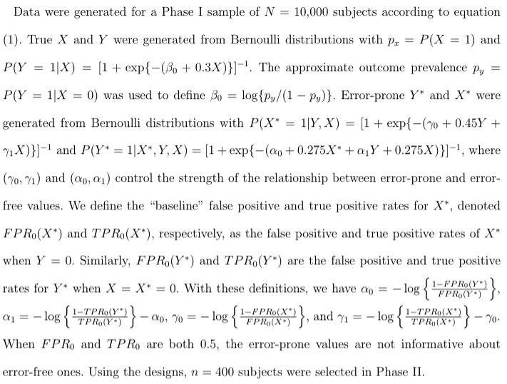
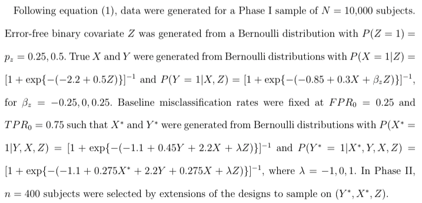
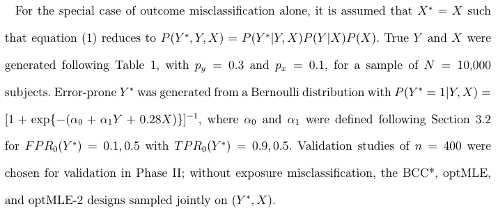
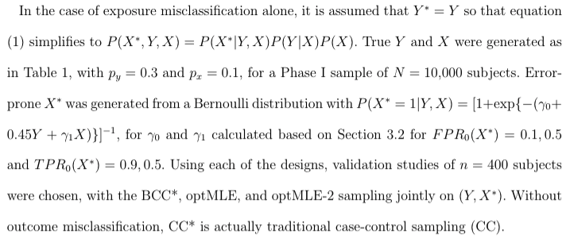

# Optimal Multi-Wave Validation for Secondary Use Data with Outcome and Exposure Misclassification
## Lotspeich, Amorim, Shaw, Tao, and Shepherd
The complete R package `auditDesignR` and code for the simulation settings included in the paper. 

### Install
To install the package, run the following in your `R` console: `devtools::install_github("sarahlotspeich/auditDesignR", ref = "main")`.

### Validation Study Designs

  - *Simple random sampling (SRS):* All subjects in Phase I have equal probability of inclusion in Phase II.
  - *Unvalidated case-control sampling (CC*):* Subjects are stratified on Y* and separate random samples of size n/2 are drawn from each stratum.
  - *Unvalidated balanced case-control sampling (BCC*):* Subjects are jointly stratified on (Y*, X*) and separate random samples of size n/4 subjects drawn from each stratum. 
  - *Optimal design (optMLE):* Subjects are jointly stratified on (Y*,X*), and stratum sizes are chosen following Section 2.2. The optMLE is included as a "gold standard" design since it requires knowing the parameters θ.
  - *Two-wave approximate optimal design (optMLE-2):* Subjects are jointly stratified on (Y*,X*). In the first wave, n/2 subjects are selected using BCC*, and in the second wave the remaining subjects are chosen following the design in Section 2.4.

### Simulation settings 
Inside the `simulations` subdirectory, you will find the following: 

#### Outcome and exposure misclassification (Table 1)

File: `simulations/YXboth_SimSetup.R`

#### Outcome and exposure misclassification with available error-free covariate information (Table 2)

File: `simulations/YXboth_inclZ_SimSetup.R`

#### Outcome only misclassification (Table S5(a))

File: `simulations/Yonly_SimSetup.R`

#### Exposure only misclassification (Table S5(b))

File: `simulations/Xonly_SimSetup.R`
